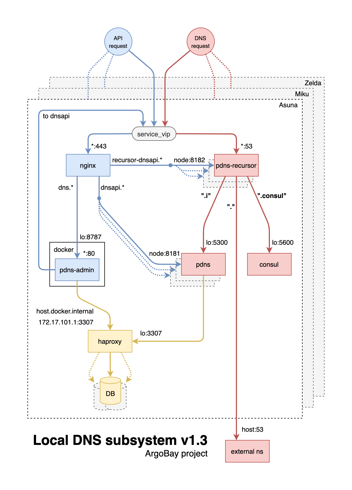

# Local DNS subsystem

Based on:
- PowerDNS recursor
- PowerDNS authorative server
- Consul

## How to access?

PowerDNS-Admin: https://dns.argobay.ml/
PowerDNS API: https://dnsapi.argobay.ml/

## How it works?

