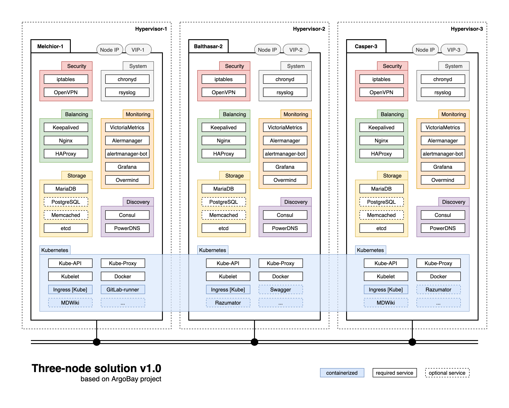

# Решение для кафедры ИУ5

Далее буду рассматривать все существующие и планирующиеся среды в такой терминологии:
- **Dev** - разработка на рабочих станциях студентов
- **Stage** - тестирование и обкатка новых технологий
- **Prod** - наиболее критичные сервисы и решения на продажу

Прямо сейчас нам Prod объективно не нужен, нет у нас пока решений на продажу. Но у нас все еще есть критичные сервисы типа тестирующей системы. Предлагаю промежуточный шаг на пути к идеалу - создаем Stage на виртуалках в Бауманском ЦОД-е, но зато сразу отказоустойчивый и прямо в нем хостим критичные сервисы. Постепенно перетаскивем все критичные сервисы со старых мест в кубер. После завершения перетаскивания можно будет расшириться преобразовав его в Prod (если железных серверов не дадут), либо он останется Stage (если будет нужна занчительная производительность и будут сервера на полноценный Prod).

На схеме представлен пример такого stage. Набор обще-инфраструктурных сервисов и Kubernetes. В кубер выкатывается все остальное, что потребуется - Разуматор, тестирующая система, и так далее.

Плюсами такой схемы являются:
- свободное горизонтальное масштабирование хоть до бесконечности
- отказоустойчивость - при потере одного узла мы все еще можем обслуживать клиентов
- балансировка нагрузки - из любого места в любое, на уровне сети или сервисов
- все как в крупных компаниях, самые актуальные технологии, много документации
- есть возможность проводить эксперименты без особого риска внутри Kubernetes

Старый кафедральный сервер оставляем как есть и потихоньку утягиваем с него все в кубер.
Потом преобразовываем его либо в prod, либо в stage. Либо оставляем как отдельный стенд, но с мониторингом от предлагаемой схемы.
